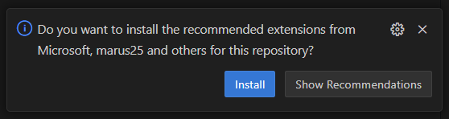

# Installation Instructions

Follow these steps to set up the development environment:

## Setup Visual Studio Code
1. Download and install [Visual Studio Code](https://code.visualstudio.com/)
2. Open workspace from repo ```drive-software-dev.code-workspace```
3. Install extensions

   - Install reccomnded extensions when prompted to by vs code<br>
   

   - If the prompt doesn't appear, you can filter to view reccomended extensions from the sidebar<br>
    


## Install STM32 Command Line Tools

1. Download the latest [STM32 Command Line Tools](https://www.st.com/en/development-tools/stm32cubeclt.html).
2. Run the installer and follow the on-screen instructions, this will automatically add all required build tools to the system path.

## Install Python

1. Ensure [python](https://www.python.org/downloads/) 3.10+ is installed.
2. Add Python to your system's PATH environment variable if needed (should be done automatically).

## Set Up Python Virtual Environment
1. Run the "Create Python venv and install dependencies" Task from "Terminal->Run Task..."<br>


<br>

# Building and Debugging
## Set Build Config
1. Open the Cmake tab on the left side panel and select a build preset<br>

## Building + Run/Debug
1. Click the "Run and Debug" tab on the left sidepanel or hit (Ctrl+Shift+D) to open the debug panel.
2. Select a "RUN AND DEBUG" configuration at the top.
3. Hit the play button or (F5) to run/debug.
## Building only
1. Hit (Ctrl+Shift+B) to build


